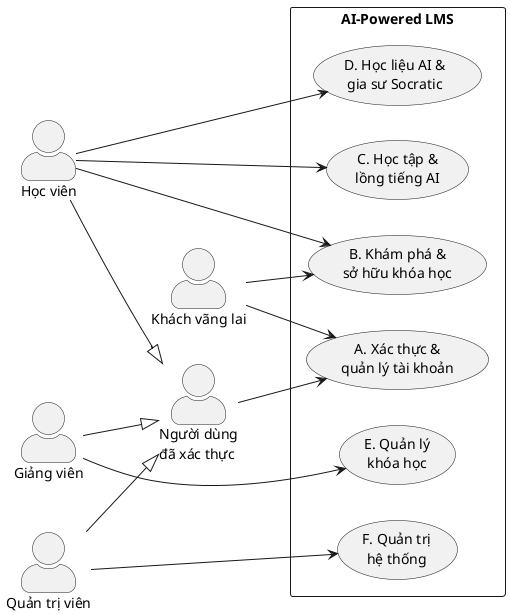
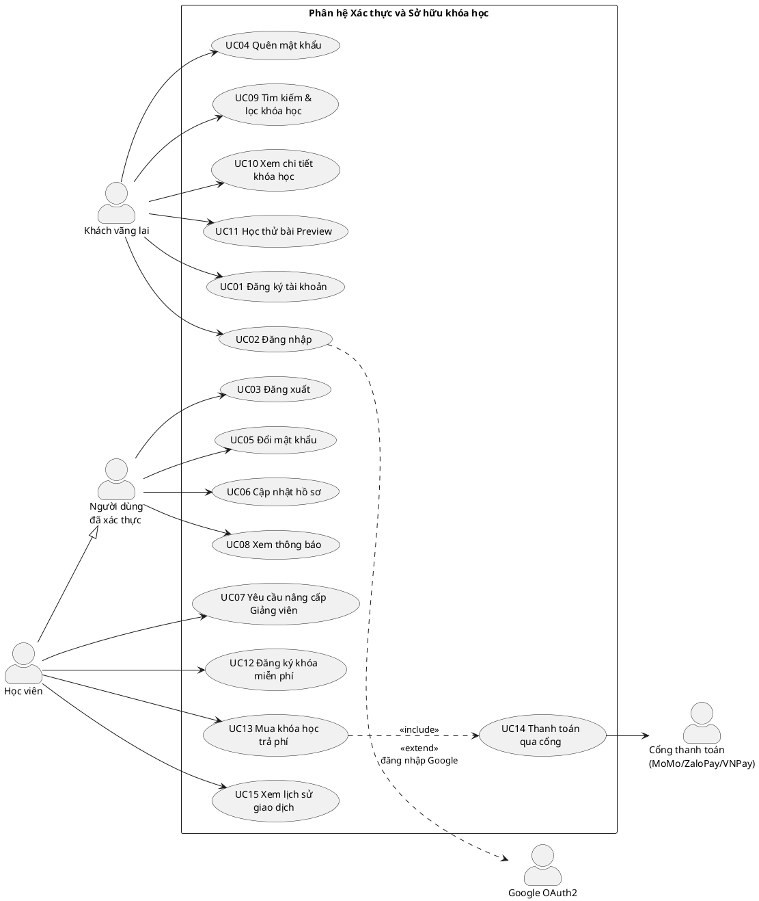
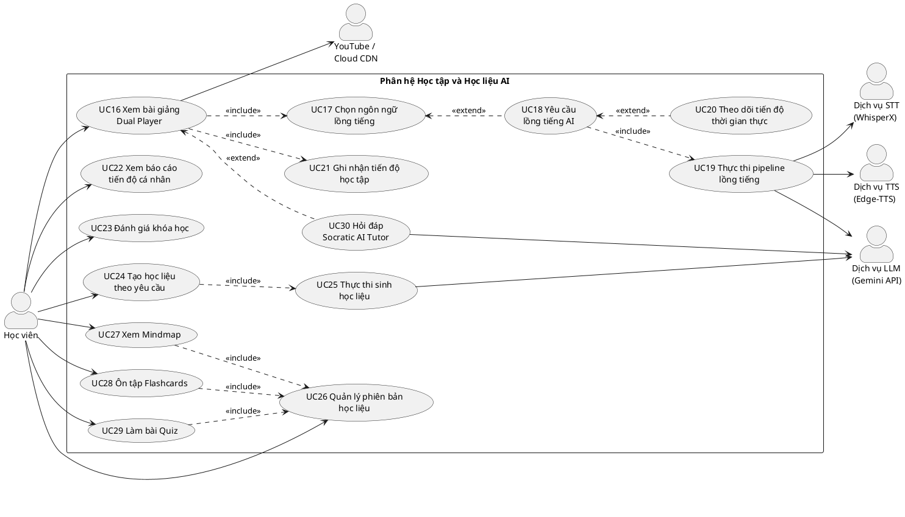
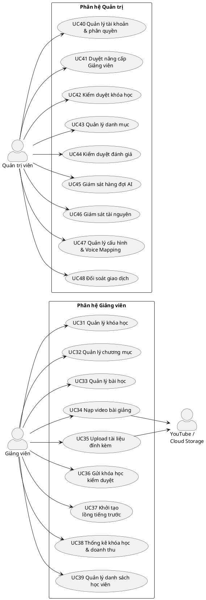

# THIẾT KẾ SƠ ĐỒ USE CASE VÀ SƠ ĐỒ LỚP
### AI-Powered LMS — Nguyễn Chí Thiện & Nguyễn Hữu Sang

> **Cách render sơ đồ:** copy đoạn mã PlantUML → dán vào https://www.plantuml.com/plantuml/uml/ → xuất PNG/SVG chèn vào Word.
> Hoặc cài extension *PlantUML* trong VS Code, nhấn `Alt+D` để xem trước.
> Nguồn PlantUML nên lưu vào repo (thư mục `docs/diagrams/`) để sau này sửa lại dễ dàng.

---

# PHẦN 1 — DANH SÁCH TÁC NHÂN (ACTORS)

## 1.1 Tác nhân chính (Primary Actors)

| Tác nhân | Kế thừa từ | Mô tả vai trò |
|---|---|---|
| **Khách vãng lai** (Guest) | — | Người dùng chưa đăng nhập. Duyệt, tìm kiếm, xem chi tiết khóa học công khai và học thử các bài Preview. Là điểm khởi đầu để chuyển đổi thành Học viên. |
| **Người dùng đã xác thực** (Authenticated User) | — | Tác nhân trừu tượng, gom các thao tác dùng chung của mọi tài khoản đã đăng nhập: đăng xuất, đổi mật khẩu, cập nhật hồ sơ, xem thông báo. |
| **Học viên** (Student) | Người dùng đã xác thực | Sở hữu khóa học (miễn phí hoặc trả phí), học bài giảng qua Dual Player, chủ động chọn/kích hoạt lồng tiếng AI, tạo học liệu theo yêu cầu, tương tác với gia sư Socratic. |
| **Giảng viên** (Instructor) | Người dùng đã xác thực | Xây dựng khóa học, nạp video bài giảng, gửi kiểm duyệt, theo dõi học viên và thống kê doanh thu. |
| **Quản trị viên** (Admin) | Người dùng đã xác thực | Quản lý tài khoản, kiểm duyệt nội dung, quản lý danh mục, giám sát hàng đợi AI và hạ tầng, đối soát giao dịch. |

> **Ghi chú UML:** dùng quan hệ tổng quát hóa (generalization) giữa các tác nhân giúp sơ đồ gọn hơn nhiều — các use case dùng chung (UC03–UC06, UC08) chỉ cần nối một lần tới *Người dùng đã xác thực* thay vì nối ba lần tới Student, Instructor và Admin.

## 1.2 Tác nhân phụ (Secondary / System Actors)

| Tác nhân phụ | Vai trò trong hệ thống | Use case liên quan |
|---|---|---|
| **Google OAuth2 Provider** | Xác thực danh tính bên thứ ba | UC02 |
| **Cổng thanh toán** (MoMo / ZaloPay / VNPay Sandbox) | Xử lý giao dịch, gửi kết quả về qua IPN callback | UC14 |
| **Dịch vụ STT** (WhisperX / Groq API) | Bóc tách lời thoại kèm mốc thời gian cấp từ | UC19 |
| **Dịch vụ LLM** (Google Gemini API) | Dịch 3 bước, sinh học liệu, suy luận Socratic | UC19, UC25, UC30 |
| **Dịch vụ TTS** (Edge-TTS) | Tổng hợp giọng đọc đa ngôn ngữ | UC19 |
| **YouTube** | Nguồn video nhúng và trình phát IFrame | UC16, UC34 |
| **Cloud Storage / CDN** (Backblaze B2, Cloudflare) | Lưu trữ và phân phối video, audio, tài liệu | UC16, UC19, UC34, UC35 |

> **Quan trọng:** Orchestrator Agent, Creator Agent và Socratic Tutor Agent **không phải là tác nhân**. Chúng là các thành phần bên trong hệ thống, được mô hình hóa bằng Component Diagram và Sequence Diagram ở mục 4.4, không đưa vào sơ đồ Use Case.

---

# PHẦN 2 — DANH SÁCH USE CASE (48 use case)

## Nhóm A — Xác thực và Quản lý tài khoản

| ID | Tên use case | Mô tả ngắn gọn | Tác nhân |
|---|---|---|---|
| UC01 | Đăng ký tài khoản | Tạo tài khoản mới bằng email, xác thực qua mã OTP | Guest |
| UC02 | Đăng nhập | Đăng nhập bằng Email/Mật khẩu (JWT) hoặc Google OAuth2 | Guest |
| UC03 | Đăng xuất | Kết thúc phiên làm việc, thu hồi Refresh Token | Người dùng đã xác thực |
| UC04 | Quên mật khẩu | Khôi phục mật khẩu qua mã OTP gửi về email | Guest |
| UC05 | Đổi mật khẩu | Thay đổi mật khẩu của tài khoản hiện tại | Người dùng đã xác thực |
| UC06 | Cập nhật hồ sơ cá nhân | Sửa họ tên, ảnh đại diện, ngôn ngữ ưa thích | Người dùng đã xác thực |
| UC07 | Gửi yêu cầu nâng cấp Giảng viên | Nộp hồ sơ, chứng chỉ để xin quyền Instructor | Học viên |
| UC08 | Xem thông báo hệ thống | Xem danh sách thông báo, đánh dấu đã đọc | Người dùng đã xác thực |

## Nhóm B — Khám phá và Sở hữu khóa học

| ID | Tên use case | Mô tả ngắn gọn | Tác nhân |
|---|---|---|---|
| UC09 | Tìm kiếm và lọc khóa học | Tra cứu theo từ khóa, danh mục, mức độ, giá | Guest, Học viên |
| UC10 | Xem chi tiết khóa học | Xem đề cương, giảng viên, ngôn ngữ hỗ trợ, đánh giá | Guest, Học viên |
| UC11 | Học thử bài giảng Preview | Xem video các bài được đánh dấu học thử | Guest, Học viên |
| UC12 | Đăng ký khóa học miễn phí | Ghi danh tức thì vào khóa học có giá bằng 0 | Học viên |
| UC13 | Mua khóa học trả phí | Khởi tạo đơn hàng cho khóa học có phí | Học viên |
| UC14 | Thanh toán qua cổng | Chuyển hướng tới MoMo/ZaloPay/VNPay và nhận kết quả IPN | Học viên, Cổng thanh toán |
| UC15 | Xem lịch sử giao dịch | Xem danh sách đơn hàng và trạng thái thanh toán | Học viên |

**Quan hệ:** UC13 `«include»` UC14 · UC12 và UC14 (thành công) cùng dẫn tới việc tạo bản ghi ghi danh

## Nhóm C — Học tập và Lồng tiếng AI *(lõi của đề tài)*

| ID | Tên use case | Mô tả ngắn gọn | Tác nhân |
|---|---|---|---|
| UC16 | Xem bài giảng bằng Dual Player | Phát video tắt tiếng đồng bộ với audio MP3 lồng tiếng | Học viên |
| UC17 | Chọn ngôn ngữ lồng tiếng | Đổi luồng âm thanh sang ngôn ngữ đã có sẵn | Học viên |
| UC18 | Yêu cầu lồng tiếng AI | Kích hoạt pipeline cho ngôn ngữ chưa tồn tại | Học viên |
| UC19 | Thực thi pipeline lồng tiếng | Chunking → STT → dịch 3 bước → Adaptive Rate → TTS → ghép audio | *(nội bộ hệ thống)* |
| UC20 | Theo dõi tiến độ xử lý thời gian thực | Nhận cập nhật trạng thái job qua WebSocket | Học viên |
| UC21 | Ghi nhận tiến độ học tập | Lưu vị trí xem, thời lượng đã xem, trạng thái hoàn thành | Học viên |
| UC22 | Xem báo cáo tiến độ cá nhân | Theo dõi phần trăm hoàn thành, điểm Quiz, lịch ôn tập | Học viên |
| UC23 | Đánh giá khóa học | Chấm sao và viết bình luận cho khóa đã sở hữu | Học viên |

**Quan hệ:** UC16 `«include»` UC17, UC21 · UC17 `«extend»` UC18 · UC18 `«include»` UC19 · UC18 `«extend»` UC20

> **UC19 là use case tổng của toàn bộ pipeline.** Không tách "Cắt đoạn video", "Bóc băng", "Dịch thuật", "Tổng hợp giọng đọc" thành các use case riêng — đó là các bước xử lý nội bộ, phải mô tả bằng Activity Diagram ở mục 4.3. Đây là lỗi phổ biến nhất trong sơ đồ use case của đồ án.

## Nhóm D — Học liệu AI và Gia sư Socratic

| ID | Tên use case | Mô tả ngắn gọn | Tác nhân |
|---|---|---|---|
| UC24 | Tạo học liệu theo yêu cầu | Chọn loại (Mindmap/Flashcards/Quiz), ngôn ngữ và phạm vi (cả khóa / một chương / bài đã hoàn thành) | Học viên |
| UC25 | Thực thi sinh học liệu | Creator Agent đọc transcript gốc, xuất trực tiếp ra ngôn ngữ đích, kiểm tra tính hợp lệ đầu ra | *(nội bộ hệ thống)* |
| UC26 | Quản lý phiên bản học liệu | Xem danh sách các bộ đã tạo, chọn bộ để học lại, xóa bộ không dùng | Học viên |
| UC27 | Xem Sơ đồ tư duy (Mindmap) | Hiển thị cây tri thức Mermaid.js, phóng to/thu nhỏ | Học viên |
| UC28 | Ôn tập Flashcards | Lật thẻ, tự đánh giá, hệ thống lên lịch lặp ngắt quãng SM-2 | Học viên |
| UC29 | Làm bài kiểm tra Quiz | Trả lời trắc nghiệm 4 lựa chọn, nhận điểm tự động | Học viên |
| UC30 | Hỏi đáp với Socratic AI Tutor | Đặt câu hỏi theo ngữ cảnh bài giảng, nhận gợi mở kèm mốc thời gian nhấp được để tua video | Học viên |

**Quan hệ:** UC24 `«include»` UC25 · UC27, UC28, UC29 đều `«include»` UC26 (phải chọn bộ học liệu trước khi học) · UC30 `«extend»` UC16

## Nhóm E — Quản lý khóa học (Giảng viên)

| ID | Tên use case | Mô tả ngắn gọn | Tác nhân |
|---|---|---|---|
| UC31 | Quản lý khóa học | Tạo, sửa, lưu trữ khóa học; đặt giá hoặc miễn phí | Giảng viên |
| UC32 | Quản lý chương mục | Tạo, sửa, xóa, sắp xếp thứ tự các chương | Giảng viên |
| UC33 | Quản lý bài học | Tạo, sửa, xóa bài học; đánh dấu bài học thử | Giảng viên |
| UC34 | Nạp video bài giảng | Tải file MP4 lên Cloud Storage hoặc dán URL YouTube | Giảng viên |
| UC35 | Upload tài liệu đính kèm | Nạp file PDF, slide, mã nguồn mẫu cho bài học | Giảng viên |
| UC36 | Gửi khóa học đi kiểm duyệt | Chuyển trạng thái DRAFT sang PENDING khi đủ điều kiện | Giảng viên |
| UC37 | Khởi tạo lồng tiếng trước | Chủ động chạy pipeline cho ngôn ngữ phổ biến, tránh để học viên đầu tiên phải chờ | Giảng viên |
| UC38 | Xem thống kê khóa học và doanh thu | Số học viên, tỷ lệ hoàn thành, doanh thu gộp, phí nền tảng 30%, số tiền thực nhận 70% | Giảng viên |
| UC39 | Quản lý danh sách học viên | Xem danh sách và tiến độ từng học viên trong khóa | Giảng viên |

## Nhóm F — Quản trị hệ thống (Admin)

| ID | Tên use case | Mô tả ngắn gọn | Tác nhân |
|---|---|---|---|
| UC40 | Quản lý tài khoản và phân quyền | CRUD người dùng, khóa/mở tài khoản, gán vai trò | Quản trị viên |
| UC41 | Duyệt yêu cầu nâng cấp Giảng viên | Xét hồ sơ, cấp hoặc từ chối quyền Instructor | Quản trị viên |
| UC42 | Kiểm duyệt khóa học | Phê duyệt PENDING sang PUBLISHED hoặc từ chối kèm lý do | Quản trị viên |
| UC43 | Quản lý danh mục môn học | Tạo, sửa, xóa cây danh mục (Category) | Quản trị viên |
| UC44 | Kiểm duyệt đánh giá và bình luận | Ẩn các đánh giá vi phạm tiêu chuẩn cộng đồng | Quản trị viên |
| UC45 | Giám sát hàng đợi AI | Theo dõi Redis Queue, kích hoạt lại các job thất bại | Quản trị viên |
| UC46 | Giám sát tài nguyên máy chủ | Theo dõi CPU, RAM của Core Service và AI Worker | Quản trị viên |
| UC47 | Quản lý cấu hình hệ thống | Khóa API dịch vụ AI, đường dẫn lưu trữ, bảng Voice Mapping | Quản trị viên |
| UC48 | Đối soát giao dịch thanh toán | Xem toàn bộ giao dịch, đối chiếu, xử lý giao dịch treo | Quản trị viên |

---

# PHẦN 3 — MÃ NGUỒN SƠ ĐỒ USE CASE (PlantUML)

Chia làm 4 sơ đồ. **Không vẽ 48 use case vào một hình** — in ra khổ A4 sẽ không đọc được và hội đồng sẽ khó chấm.

## 3.1 Sơ đồ tổng quát (Actor và các phân hệ)



## 3.2 Sơ đồ Use Case — Phân hệ Xác thực và Sở hữu khóa học



## 3.3 Sơ đồ Use Case — Phân hệ Học tập, Lồng tiếng và Học liệu AI *(sơ đồ quan trọng nhất)*



## 3.4 Sơ đồ Use Case — Phân hệ Giảng viên và Quản trị



---

# PHẦN 4 — SƠ ĐỒ LỚP (Class Diagram)

Chia thành 3 gói. Mỗi gói là một hình riêng trong báo cáo, kèm bảng đặc tả thuộc tính.

## 4.1 Gói 1 — Người dùng, Khóa học và Thanh toán

```plantuml
@startuml Class_Package1
skinparam classAttributeIconSize 0
skinparam shadowing false
hide circle

enum Role        { STUDENT \n INSTRUCTOR \n ADMIN }
enum CourseStatus{ DRAFT \n PENDING \n PUBLISHED \n REJECTED \n ARCHIVED }
enum PaymentStatus { PENDING \n PAID \n FAILED \n EXPIRED }

class User {
  - id : Long
  - email : String
  - passwordHash : String
  - fullName : String
  - avatarUrl : String
  - role : Role
  - authProvider : AuthProvider
  - preferredLanguage : String
  - isActive : Boolean
  - createdAt : LocalDateTime
  + hasRole(role) : boolean
  + isOwnerOf(course) : boolean
}

class InstructorRequest {
  - id : Long
  - motivation : String
  - credentialUrl : String
  - status : RequestStatus
  - rejectReason : String
  - createdAt : LocalDateTime
}

class Category {
  - id : Long
  - name : String
  - slug : String
}

class Course {
  - id : Long
  - title : String
  - slug : String
  - description : String
  - thumbnailUrl : String
  - level : CourseLevel
  - price : BigDecimal
  - isFree : Boolean
  - status : CourseStatus
  - rejectReason : String
  - avgRating : BigDecimal
  - totalLessons : Integer
  + canSubmitForReview() : boolean
  + isAccessibleBy(user) : boolean
}

class Chapter {
  - id : Long
  - title : String
  - displayOrder : Integer
}

class Lesson {
  - id : Long
  - title : String
  - videoSource : VideoSource
  - videoUrl : String
  - youtubeId : String
  - durationSec : Integer
  - sourceLanguage : String
  - displayOrder : Integer
  - isPreview : Boolean
  - status : LessonStatus
}

class LessonDocument {
  - id : Long
  - fileName : String
  - fileUrl : String
  - fileType : String
  - fileSize : Long
}

class Payment {
  - id : Long
  - txnRef : String
  - amount : BigDecimal
  - platformFee : BigDecimal
  - instructorEarning : BigDecimal
  - paymentMethod : PaymentMethod
  - status : PaymentStatus
  - gatewayTxnNo : String
  - paidAt : LocalDateTime
  + calculateSplit(feePct) : void
}

class Enrollment {
  - id : Long
  - progressPct : BigDecimal
  - enrolledAt : LocalDateTime
  - completedAt : LocalDateTime
  + recalculateProgress() : void
}

class LessonProgress {
  - id : Long
  - lastPositionSec : Integer
  - watchedSec : Integer
  - isCompleted : Boolean
  + markCompletedIfReached(threshold) : void
}

class CourseReview {
  - id : Long
  - rating : Integer
  - comment : String
  - isHidden : Boolean
}

class Notification {
  - id : Long
  - type : String
  - title : String
  - content : String
  - linkUrl : String
  - isRead : Boolean
}

User "1" -- "0..*" InstructorRequest : gửi >
User "1" -- "0..*" Course      : giảng dạy >
User "1" -- "0..*" Enrollment  : sở hữu >
User "1" -- "0..*" Payment     : thực hiện >
User "1" -- "0..*" LessonProgress
User "1" -- "0..*" CourseReview
User "1" -- "0..*" Notification

Category "1" -- "0..*" Course
Course "1" *-- "1..*" Chapter
Chapter "1" *-- "1..*" Lesson
Lesson "1" *-- "0..*" LessonDocument
Course "1" -- "0..*" Enrollment
Course "1" -- "0..*" Payment
Course "1" -- "0..*" CourseReview
Lesson "1" -- "0..*" LessonProgress
Payment "0..1" -- "0..1" Enrollment : phát sinh >
@enduml
```

**Ba điểm thiết kế cần lưu ý khi code gói này:**

1. `Payment` lưu sẵn `platformFee` và `instructorEarning` tại thời điểm giao dịch, **không tính lại lúc hiển thị**. Nếu sau này đổi tỷ lệ 30% thành 25%, các giao dịch cũ vẫn giữ đúng số tiền lịch sử. Màn hình UC38 hiển thị ba con số: tổng `amount` (doanh thu gộp), tổng `platformFee` (đã trả nền tảng), tổng `instructorEarning` (thực nhận).
2. `Enrollment` được tạo trong cùng một giao dịch cơ sở dữ liệu với việc cập nhật `Payment.status = PAID` — hoặc tạo ngay lập tức nếu `Course.isFree = true`.
3. `Lesson.sourceLanguage` là bắt buộc để hiện thực BR-DUB-10 (chặn lồng tiếng trùng ngôn ngữ gốc). Trường này được điền tự động sau lần bóc băng đầu tiên.

## 4.2 Gói 2 — Pipeline lồng tiếng AI

```plantuml
@startuml Class_Package2
skinparam classAttributeIconSize 0
skinparam shadowing false
hide circle

enum JobStatus   { PENDING \n PROCESSING \n COMPLETED \n FAILED \n SKIPPED }
enum TrackStatus { PROCESSING \n PARTIAL \n COMPLETED \n FAILED }

class AiJob {
  - id : Long
  - jobType : JobType
  - targetLanguage : String
  - status : JobStatus
  - totalChunks : Integer
  - doneChunks : Integer
  - celeryTaskId : String
  - retryCount : Integer
  - errorMessage : String
  - startedAt : LocalDateTime
  - finishedAt : LocalDateTime
  + progressPercent() : int
  + canRetry() : boolean
}

class AiJobChunk {
  - id : Long
  - chunkIndex : Integer
  - startSec : Integer
  - endSec : Integer
  - status : JobStatus
  - retryCount : Integer
}

class Transcript {
  - id : Long
  - language : String
  - isSource : Boolean
  - fullText : String
}

class TranscriptSegment {
  - id : Long
  - seq : Integer
  - startSec : BigDecimal
  - endSec : BigDecimal
  - text : String
  - speechRate : BigDecimal
  - wasSummarized : Boolean
  + originalDuration() : BigDecimal
}

class AudioTrack {
  - id : Long
  - language : String
  - voiceName : String
  - finalUrl : String
  - durationSec : Integer
  - fileSize : Long
  - status : TrackStatus
  - playCount : Long
}

class AudioChunk {
  - id : Long
  - chunkIndex : Integer
  - startSec : Integer
  - endSec : Integer
  - fileUrl : String
}

class VoiceMapping {
  - id : Long
  - language : String
  - voiceName : String
  - gender : Gender
  - isDefault : Boolean
  - isActive : Boolean
}

class Lesson <<Gói 1>> {
}

Lesson "1" -- "0..*" AiJob        : kích hoạt >
Lesson "1" -- "0..*" Transcript
Lesson "1" -- "0..*" AudioTrack
AiJob  "1" *-- "1..*" AiJobChunk
Transcript "1" *-- "1..*" TranscriptSegment
AudioTrack "1" *-- "0..*" AudioChunk
VoiceMapping "1" -- "0..*" AudioTrack : sử dụng >
@enduml
```

**Điểm thiết kế:** `AiJob` có ràng buộc duy nhất trên bộ ba `(lesson_id, targetLanguage, status đang hoạt động)` để hiện thực BR-DUB-05 (chống trùng job). `TranscriptSegment.speechRate` lưu lại hệ số R đã áp dụng — chính là dữ liệu để các bạn dựng bảng số liệu cho mục 6.3.3 khi đánh giá thuật toán Adaptive Speech Rate.

## 4.3 Gói 3 — Học liệu AI và Gia sư Socratic

```plantuml
@startuml Class_Package3
skinparam classAttributeIconSize 0
skinparam shadowing false
hide circle

enum MaterialType  { MINDMAP \n FLASHCARD \n QUIZ }
enum ScopeType     { WHOLE_COURSE \n CHAPTER \n COMPLETED_LESSONS }
enum GenStatus     { PENDING \n PROCESSING \n COMPLETED \n FAILED }

class MaterialGeneration {
  - id : Long
  - materialType : MaterialType
  - language : String
  - scopeType : ScopeType
  - scopeRefId : Long
  - versionNo : Integer
  - title : String
  - status : GenStatus
  - celeryTaskId : String
  - errorMessage : String
  - createdAt : LocalDateTime
  + isReusableBy(user) : boolean
}

class Mindmap {
  - id : Long
  - mermaidCode : String
  - nodeCount : Integer
}

class FlashcardDeck {
  - id : Long
  - cardCount : Integer
}

class Flashcard {
  - id : Long
  - frontText : String
  - backText : String
}

class FlashcardReview {
  - id : Long
  - easiness : BigDecimal
  - intervalDays : Integer
  - repetitions : Integer
  - nextReviewAt : LocalDate
  + applySM2(quality) : void
}

class Quiz {
  - id : Long
  - questionCount : Integer
}

class QuizQuestion {
  - id : Long
  - content : String
  - displayOrder : Integer
}

class QuizOption {
  - id : Long
  - content : String
  - isCorrect : Boolean
}

class QuizAttempt {
  - id : Long
  - score : BigDecimal
  - totalQuestions : Integer
  - correctCount : Integer
  - submittedAt : LocalDateTime
}

class QuizAnswer {
  - id : Long
  - isCorrect : Boolean
}

class ChatSession {
  - id : Long
  - createdAt : LocalDateTime
}

class ChatMessage {
  - id : Long
  - sender : SenderType
  - content : String
  - citedTimestamps : String
  - tokenUsed : Integer
}

class User   <<Gói 1>> { }
class Course <<Gói 1>> { }
class Lesson <<Gói 1>> { }

User   "1" -- "0..*" MaterialGeneration : yêu cầu tạo >
Course "1" -- "0..*" MaterialGeneration
MaterialGeneration "1" *-- "0..1" Mindmap
MaterialGeneration "1" *-- "0..1" FlashcardDeck
MaterialGeneration "1" *-- "0..1" Quiz

FlashcardDeck "1" *-- "1..*" Flashcard
Flashcard "1" -- "0..*" FlashcardReview
User "1" -- "0..*" FlashcardReview

Quiz "1" *-- "1..*" QuizQuestion
QuizQuestion "1" *-- "4" QuizOption
Quiz "1" -- "0..*" QuizAttempt
User "1" -- "0..*" QuizAttempt
QuizAttempt "1" *-- "1..*" QuizAnswer
QuizQuestion "1" -- "0..*" QuizAnswer

User   "1" -- "0..*" ChatSession
Lesson "1" -- "0..*" ChatSession
ChatSession "1" *-- "0..*" ChatMessage
@enduml
```

**`MaterialGeneration` là lớp trung tâm của gói này** — nó hiện thực hóa cả bốn quyết định thiết kế của nhóm:

| Quyết định | Thuộc tính tương ứng |
|---|---|
| Học liệu ở cấp khóa học | Liên kết tới `Course`, không phải `Lesson` |
| Mỗi học viên có bộ riêng | Liên kết tới `User` |
| Lưu nhiều phiên bản để xem lại | `versionNo` + `title` (UC26) |
| Chọn loại, ngôn ngữ, phạm vi | `materialType`, `language`, `scopeType` + `scopeRefId` |

`QuizQuestion` không còn `explanation` và `timestampSec` theo đúng yêu cầu đơn giản hóa. Bội số `"4"` giữa `QuizQuestion` và `QuizOption` thể hiện ràng buộc luôn đúng 4 lựa chọn.

---

# PHẦN 5 — GHI CHÚ TRIỂN KHAI

**5.1 Về việc lưu nhiều phiên bản học liệu.** Vì mỗi học viên tạo bộ riêng và giữ lại bộ cũ, số bản ghi `MaterialGeneration` sẽ tăng nhanh. Đề xuất giới hạn: mỗi học viên giữ tối đa **10 bộ trên một khóa học**; khi vượt, hệ thống yêu cầu xóa bớt trước khi tạo mới. Kết hợp với hạn mức 6 lần/ngày, dữ liệu sẽ nằm trong tầm kiểm soát.

**5.2 Về tiến độ ôn tập khi đổi ngôn ngữ.** `FlashcardReview` gắn với `Flashcard` cụ thể, mà `Flashcard` thuộc về một `MaterialGeneration` có ngôn ngữ riêng. Hệ quả: học viên tạo bộ thẻ mới thì lịch SM-2 bắt đầu lại từ đầu. Đây là hành vi đúng về mặt sư phạm (bộ thẻ mới là nội dung mới), nhưng nên ghi một dòng vào mục 7.2 Hạn chế để chủ động.

**5.3 Về điểm Quiz trong báo cáo tiến độ.** Vì mỗi học viên có thể có nhiều bộ Quiz ở nhiều ngôn ngữ, điểm hiển thị ở UC22 nên là **điểm cao nhất trên tất cả các lần làm, thuộc mọi bộ Quiz của khóa học đó**, không tách theo từng bộ.

**5.4 Thứ tự hiện thực đề xuất.** Gói 1 trước (không phụ thuộc gì), rồi Gói 2 (lõi đề tài, rủi ro cao nhất — làm sớm để còn kịp xoay xở), cuối cùng Gói 3. Trong Gói 3 làm theo thứ tự Quiz → Flashcard → Mindmap, vì Quiz có cấu trúc JSON đơn giản nhất, dễ validate nhất, và cũng dễ demo nhất.

**5.5 Các sơ đồ còn cần vẽ ở Chương 4** ngoài use case và class: Activity Diagram cho UC19 (pipeline lồng tiếng) và UC25 (sinh học liệu); Sequence Diagram cho UC02, UC14, UC18, UC30; Component Diagram cho kiến trúc Dual-Service; và ERD cho cơ sở dữ liệu.
